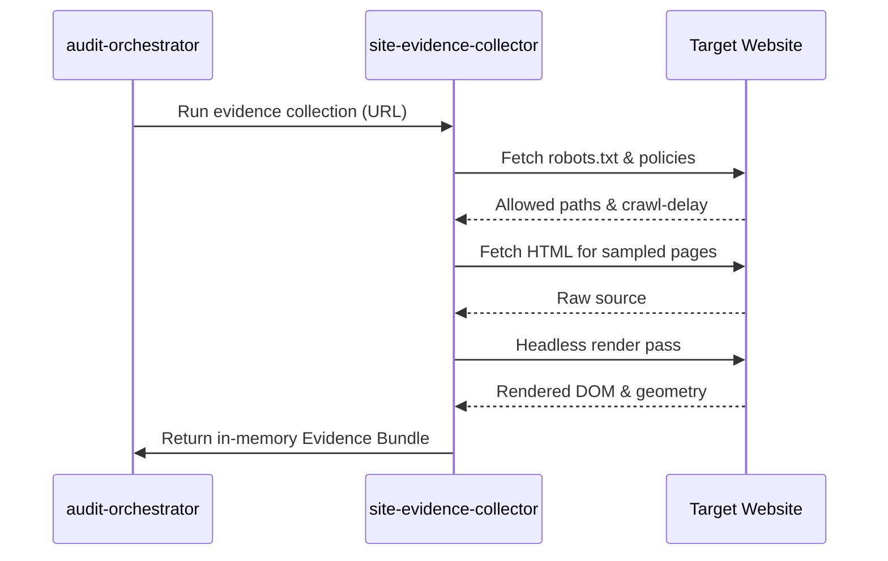
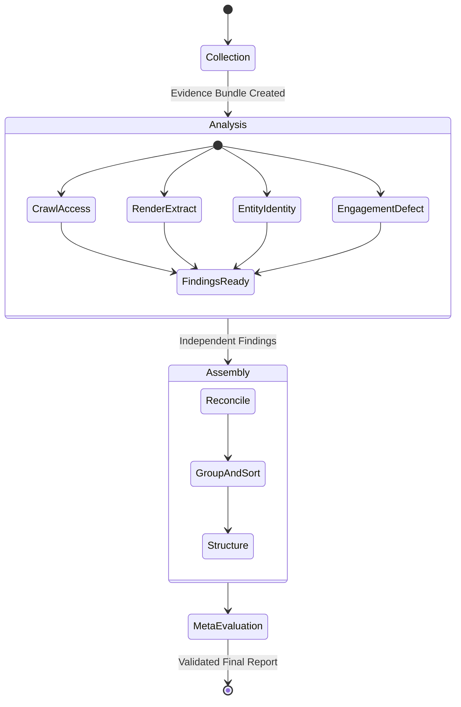

# Brand AI Readiness Audit: Process Explanation

This document explains the end-to-end execution process of the Brand AI Readiness Audit marketplace. The system is designed to provide actionable, evidence-based audits for off-site discoverability and on-site engagement without hallucinating unverifiable claims.

## High-Level Architecture

The marketplace consists of six distinct skills organized into a strict "collect -> analyze -> assemble" pipeline. The `audit-orchestrator` serves as the entrypoint and coordinates the entire execution. 

```mermaid
flowchart TD
    O[audit-orchestrator\n(Entrypoint)]
    
    subgraph Phase 1: Collection
        C[site-evidence-collector]
        NET((Live Site\nNetwork Access))
    end
    
    subgraph Phase 2: Analysis
        A1[crawl-access-audit]
        A2[render-extractability-audit]
        A3[entity-identity-audit]
        A4[engagement-defect-audit]
    end
    
    subgraph Phase 3: Assembly
        R[Reconcile & Suppress]
        ASM[Assemble Report]
        ME[Meta-Evaluation]
        REP[[Final Structured Report]]
    end

    O -->|1. Invokes| C
    C <-->|Reads robots.txt, HTML,\nrenders pages| NET
    C -->|Produces in-memory\nEvidence Bundle| O
    
    O -->|2. Distributes bundle to| A1
    O -->|2. Distributes bundle to| A2
    O -->|2. Distributes bundle to| A3
    O -->|2. Distributes bundle to| A4
    
    A1 -->|Emits Findings| O
    A2 -->|Emits Findings| O
    A3 -->|Emits Findings| O
    A4 -->|Emits Findings| O
    
    O -->|3. Resolves dependencies| R
    R -->|4. Categorizes outputs| ASM
    ASM -->|5. Validates constraints| ME
    ME --> REP
```

## Detailed Execution Steps

### 1. Collect
The pipeline begins when the `audit-orchestrator` invokes the `site-evidence-collector`. 
**Crucially, this is the only skill that touches the network.** It gathers data safely by obeying `robots.txt`, enforcing a strict time budget, and collecting:
- A sampled page inventory (e.g., homepage, content pages)
- Raw HTML source content
- Headless browser rendered evidence
- Bounded off-site and internal link validations



### 2. Analyse
Once the orchestrator receives the completed Evidence Bundle, it distributes it to four independent analysers. These skills are "blind" to each other and operate purely in read-only mode against the bundle (no network access):
- **`crawl-access-audit`**: Checks if AI-crawlers (retrieval and training bots) are actually permitted.
- **`render-extractability-audit`**: Evaluates content extractability by comparing raw HTML vs. rendered content.
- **`entity-identity-audit`**: Checks brand consistency, schema markup, and external profile anchoring.
- **`engagement-defect-audit`**: Looks for statically detectable engagement defects such as accessibility issues, blocking overlays, and dense ad placement.

### 3. Reconcile
The orchestrator receives all the independent findings. Because the analysers are blind to each other, they might flag symptoms of the same root issue. The orchestrator resolves cross-skill dependencies (e.g., a blank-first-paint finding might yield to a render-gap finding so the site isn't penalized twice for the same defect).

### 4. Assemble
The orchestrator structures the reconciled data into three distinct arrays:
- **`findings[]`**: Confirmed, evidence-backed defects capped at their actual severity.
- **`recommendations[]`**: Proactive suggestions scoped specifically to the site's vertical (archetype).
- **`limitations[]`**: Explicit declarations of what the audit could not measure (e.g., cross-web brand agreement or actual AI assistant citation behavior).

### 5. Meta-Evaluate
Before finalizing, a self-check is performed over the assembled report:
- Do finding counts and severities reconcile?
- Are prohibited recommendations (like confidently suggesting "add an `llms.txt`" as a substantive fix) properly excluded from the text?
- Are all required structural limitations explicitly stated?


